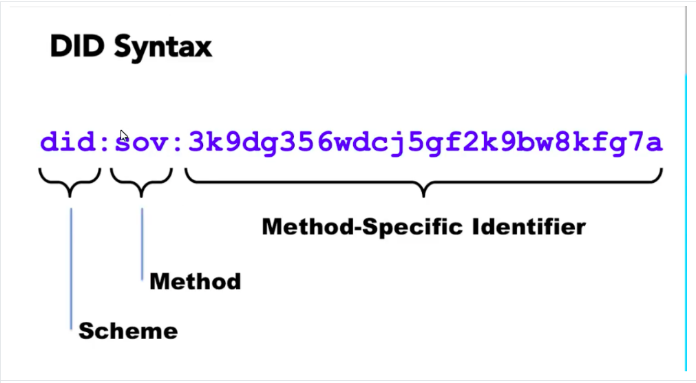
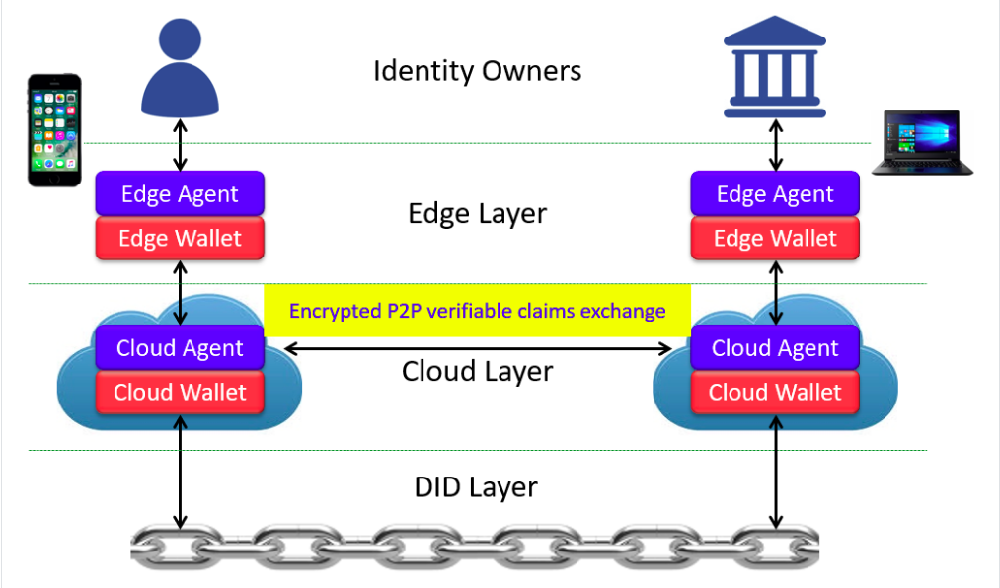
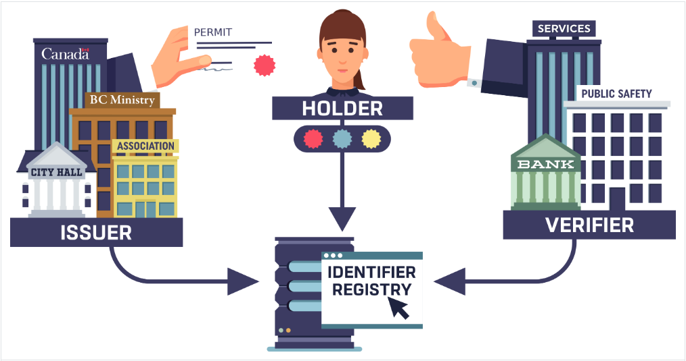

## ToIP – Trust over IP​ Foundation

It comes under the Linux Founddation. The mission of the ToIP foundation is to simplify and standardize how trust is established online so that everyone can feel safe, 
secure, and private in all of our digital interactions — whether between individuals, businesses, governments, or any “thing” on the Internet of Things.

***

## DID – Decentralized Identifier

DIDs are globally unique identifiers that are created by their owner, independent of any central authority. Each DID has associated with it one or more public keys created 
by the DID owner (and the owner holds the corresponding private keys), and one or more endpoints - addresses where messages can be delivered for that identity. A DID can 
be uniquely resolved (like a URL) to return the the data (public keys and endpoints) associated with the DID. 

***

## Agents and Wallets

It is hard to manage all the DIDs a person creates or receives. Indy uses the term "Agent" to mean the software that interacts with other entities, and the term "Wallet" as a data store for the DIDs and related information. For example, a person might have a mobile Agent app on their smart devices, while an Organization might have an enterprise Agent running on a Cloud Server. All Agents have a secure Wallet for storing identity data.

A personal Agent wallet is similar to a password manager - there is a name for each relationship and associated data. However, unlike Password Managers that use things 
like your copy/paste clipboard for User IDs and Passwords and "screen-scrape" applications and websites, Agents communicate directly with Agents to accomplish 
Identity-related tasks.

The picture below is an example of some communicating Indy Agents. The Edge Agents are handled by the Identity owners themselves - in this case a Consumer and an 
Enterprise. The Cloud Agents facilitate the messaging by, for example, providing a permanent endpoint for a device that may or may not be online at the time messages are 
being received.

***

## Credential 

Credentials are things like driver's licenses, passports, or university degrees that are given to us from an issuing authority that we can use to show to others when needed. 

***

## Verifiable Credential(VC)

VCs are digital equivalents of paper credentials that are cryptographically processed such that when we show ("prove") the claims (data elements from the Credentials), the 
receiver ("Verifier") can be certain:
- Who issued the claims
- That the claims were issued to the Identity presenting them
- That the claims have not been tampered with (forged), and
- That the claims' Credential has not been revoked by the Issuer.

As the image below shows, the data flow for Verifiable Credentials is the same as with paper documents - Issuers give Verifiable Credentials to the Holder, and the Holder 
can prove them to Verifiers at any time.

***

## Issuer, Holder, Verifier

- Issuer - Issues Verifiable Credentials to the Holder
- Holder - Holders request credentials from issuers, hold them in their wallets and present them when requested by verifiers
- Verifier - Verifies the claims presented by the Holder

***

## TIP – Trust over IP Interoperability Profile​

A TIP represents a specific combination of technologies that span each of the four layers of the ToIP technology stack in order to meet the requirements of a set of target 
customers in one or more digital trust ecosystems. TIPs can be designed, refined and supported by multiple vendors and customers wishing to collaborate on interoperability.

***

## TSWG – Technology Stack Working Group​

This working group (members) concerns a broadly defined and broadly applicable set of technologies (the "stack of technology") that can be used to promote the ability of 
project-level scientists to build web-based data and processing services that are readily found and used by others. Part of this effort is to promote interoperability 
between individual services in order to help scientists pursue more integrated science.

***

## GDPR - General Data Protection Regulation​

General Data Protection Regulation is meant to fundamentally reshape how personal data are collected and processed by giving all individuals living in the European Union 
(or the greater European Economic Area) new rights to access and control their data on the Internet.

***

## Identity Utility Network

An Identity Utility Network associated with a DID Root Namespace that operates under its own Governance Framework.

***

## Digital Trust Ecosystem

An interdependent group of enterprises, people and/or things that share a standardized trust model for mutually beneficial purposes, such as consumer and commercial 
interactions that are verifiable.

***

## DID Namespace

Building on URI Standards, the DID Specification allows for both root namespace (did:xxx) and sub-namespace (did:xxx:yyy) conventions.

***

## Node

A computer network server running an instance of the code necessary to operate a distributed ledger or blockchain. 

